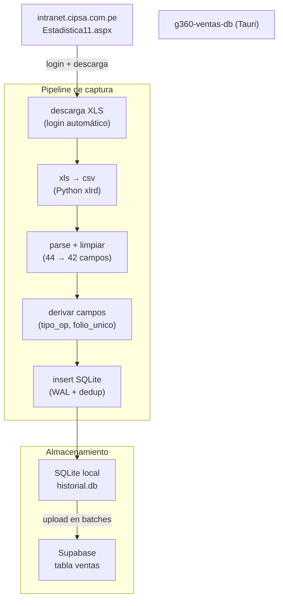
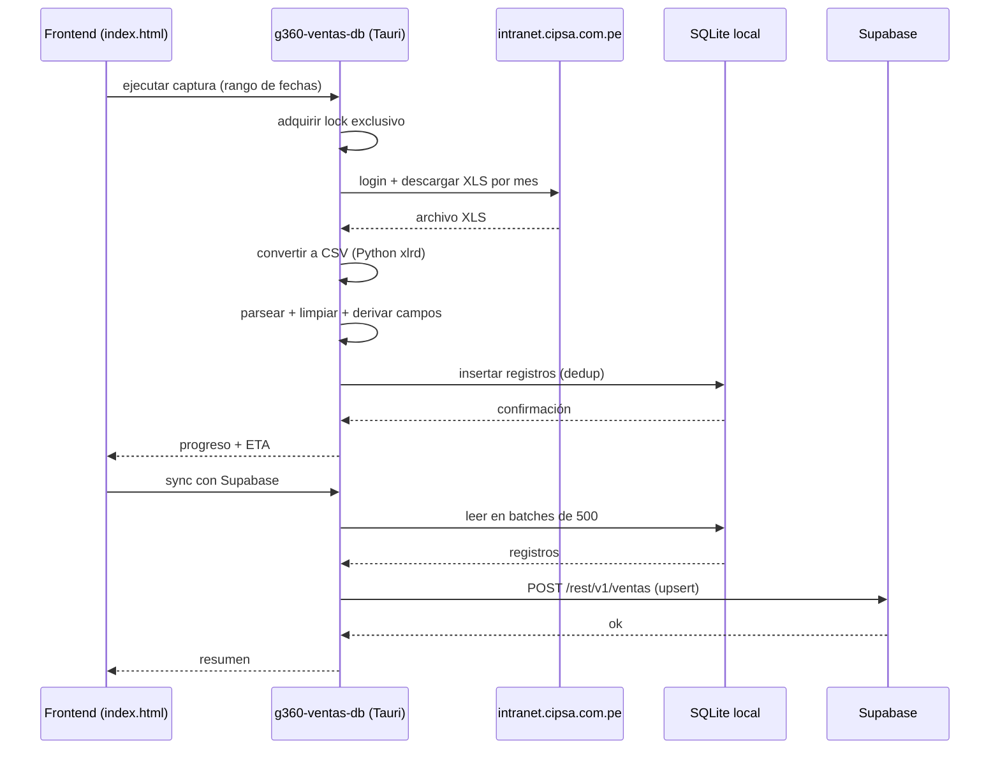
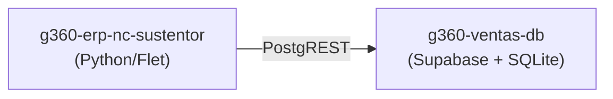

# g360-ventas-db

> Solución de datos orientada al procesamiento y generación de una base de datos derivada a partir de información corporativa de ventas, aislada de la fuente original y enfocada en el área de Consumo Masivo. App de escritorio (Tauri) que captura, limpia y normaliza en SQLite local y sincroniza con **Supabase** para CRM. Forma parte del ecosistema G360.

[](https://github.com)
[](https://github.com/carloscus/g360-cli)
[](https://www.rust-lang.org/)
[](https://tauri.app/)

## ¿Cómo está organizado el proyecto?



## Tabla de Contenidos

- [Descripción](#descripción)
- [Objetivo](#objetivo)
- [Arquitectura](#arquitectura)
- [Pipeline de captura](#pipeline-de-captura)
- [Esquema de datos](#esquema-de-datos)
- [Campos derivados](#campos-derivados)
- [Vistas para API de devoluciones](#vistas-para-api-de-devoluciones)
- [Guía rápida](#guía-rápida)
- [Interfaz de escritorio](#interfaz-de-escritorio)
- [Configuración](#configuración)
- [Retención de datos](#retención-de-datos)
- [API REST para downstream](#api-rest-para-downstream)
- [CLI](#cli)
- [Desarrollo](#desarrollo)
- [Protecciones](#protecciones)
- [Ecosistema G360](#ecosistema-g360)

---

## Descripción

Ventas DB genera una base derivada a partir de información corporativa de ventas, acotada al área de Consumo Masivo y aislada de la fuente original. Evita modificaciones sobre el origen, reduce el acoplamiento con otras áreas y facilita el tratamiento y análisis comercial en un ámbito controlado.

Opera bajo principio de mínimo privilegio: solo datos necesarios para el área, sin persistencia de credenciales en el repositorio y con control de acceso a nivel de tabla. Aplica buenas prácticas de estructuración y gestión, con enfoque en privacidad y tratamiento de información sensible. La app de escritorio descarga el reporte desde el intranet (Estadistica11.aspx), lo normaliza en SQLite local y lo sincroniza con Supabase para el CRM.

**Tipo**: Aplicación de escritorio (Tauri v2)  
**Runtime**: Rust 1.75+ / Tauri 2.x  
**Uso**: Equipo de Consumo Masivo, analistas y sistema CRM

---

## Objetivo

Construir una capa de datos derivada y aislada para el procesamiento y análisis de información de ventas de un área específica, utilizando como fuente información corporativa sin modificar el origen, facilitando un ámbito de trabajo desacoplado, gobernable y auditable.

---

## Arquitectura



---

## Pipeline de captura

```
1. Preflight      → verifica credenciales intranet + Chrome instalado
2. Lock           → handle exclusivo (evita capturas simultáneas)
3. Descarga       → por mes: Estadistica11.aspx → XLS
4. Conversión     → XLS → CSV (Python xlrd)
5. Parsing        → CSV → struct Venta (42 campos)
6. Derivación     → tipo_operacion, factura_ref, folio_unico
7. Inserción      → SQLite (WAL, dedup por mes)
8. Upload         → SQLite → Supabase (batches de 500)
```

### Smart sync

| Condición | Modo | Detalle |
|-----------|------|---------|
| Hueco ≤ 7 días | **Diario** | descarga día por día |
| Hueco > 7 días | **Mensual** | descarga por mes (más rápido) |

---

## Esquema de datos

Tabla `ventas` (SQLite local + Supabase). **42 columnas** efectivas (+ `id` y `capturado_en`).

| Grupo | Campos |
|-------|--------|
| **Producto** | `id_articulo`, `original_sku`, `nom_articulo`, `id_linea`, `nom_linea`, `id_grupo`, `nom_grupo`, `id_tipo`, `nom_tipo`, `id_familia`, `nom_familia` |
| **Cliente** | `id_cliente`, `doc_cliente` (RUC), `nom_cliente` |
| **Documento** | `tpo_doc`, `serie_doc`, `nro_doc`, `referencia`, `folio_unico` |
| **Montos** | `moneda`, `cantidad`, `soles`, `dolares`, `precio_unitario` |
| **Fechas** | `anho`, `mes`, `fecha_orig`, `fecha_ref`, `fecha_venc` |
| **Ubicación** | `cod_sucursal`, `nom_sucursal`, `departamento`, `provincia`, `distrito` |
| **Vendedor** | `id_vendedor`, `nom_vendedor` |
| **Pedido** | `id_pedido` |
| **Metadata** | `file_source`, `mes_ref`, `tipo_operacion`, `factura_ref_serie`, `factura_ref_nro` |

---

## Campos derivados

Calculados por el parser al capturar, para facilitar el cruce en el CRM:

| Campo | Cálculo | Ejemplo |
|-------|---------|---------|
| `tipo_operacion` | según `tpo_doc` + signo de `cantidad` | `venta`, `devolucion`, `ajuste_valor`, `nota_debito` |
| `factura_ref_serie` | parseado de `referencia` | `201` |
| `factura_ref_nro` | parseado de `referencia` | `199685` |
| `folio_unico` | `tpo_doc/serie_doc/nro_doc` | `F01/201/47967` |

> La referencia `F01/201-199685` en una NCR permite cruzar la **devolución** con la **factura** original (`serie_doc=201`, `nro_doc=199685`).

---

## Vistas para API de devoluciones

Se crean en Supabase (migración `supabase/migrations/20250828000003_vw_retornos.sql`) y se sincronizan localmente a SQLite para offline.

| Vista | Qué contiene | Uso |
|-------|--------------|-----|
| `vw_dim_articulo` | SKU, nombre, línea, grupo (agregado por `id_articulo`) | Catálogo consultable |
| `vw_dim_cliente` | Cliente ID, RUC, razón social | Lookup de clientes |
| `vw_nc_totales` | Suma de `cantidad_fae` y `soles` de NCs que cubren ≥99% de la factura | Cálculo de precio neto |
| `vw_nc_parciales` | NCs que no llegan al 99% (informativas, no afectan precio) | Alertas de negocio |
| `vw_facturas_disponibles` | Cada factura con saldo disponible y precio para devolución | Motor LIFO |

**Reglas de negocio aplicadas:**

- NC total = suma de `abs(cantidad_fae)` ≥ 99% de `cantidad_vendida` → reduce el precio base
- NC parcial = <99% → solo informativa, no altera precio
- Precio para devolución = `precio_unitario - (total_monto / total_fae)` cuando hay NC total
- Periodo = alerta si la factura es mayor a 3 años (`FUERA_PERIOD`)
- Moneda = todos los valores en Soles

Índices creados: `idx_retorno_cliente_sku`, `idx_retorno_folio`, `idx_retorno_ref`.

---

## Guía rápida

### 1. Configurar credenciales

```bash
cp .env.example .env
```

```bash
G360_INTRANET_USER=usuario_demo
G360_INTRANET_PASS=password_demo
```

### 2. Capturar ventas

1. Abre la app Tauri (`g360-db-ventas-tauri.exe`).
2. Selecciona el rango de fechas (desde / hasta).
3. Click **"ejecutar captura"**.
4. El pipeline descarga cada mes y lo inserta en SQLite.

### 3. Sincronizar con Supabase

- Click **"sinc con supabase"**.
- Los registros se suben en batches de 500 con `onConflict=folio_unico`.

---

## Interfaz de escritorio

| Elemento | Función |
|----------|---------|
| **KPIs** | registros, ventas totales, clientes, SKUs |
| **Badges** | captura → proceso → local (fase actual) |
| **Barra progreso** | avance de la captura + ETA |
| **📅 meses** | gestionar meses capturados (eliminar) |
| **👁 vista previa** | ver headers + 2 filas del CSV más reciente |
| **⏹ detener** | abortar captura en curso |
| **⚙ config** | intranet, Supabase, líneas permitidas, retención, auto-sync |

### Modal de configuración

| Sección | Campo |
|---------|-------|
| **Intranet CIPSA** | usuario, clave |
| **Reporte** | generado por (responsable) |
| **Destino Supabase** | URL, anon key, tabla |
| **Líneas permitidas** | sufijos de línea de producto (avanzado) |
| **Comportamiento** | auto-sync al abrir, retención de datos |

---

## Configuración

### Variables de entorno

| Variable | Descripción |
|----------|-------------|
| `G360_INTRANET_USER` | Usuario del intranet |
| `G360_INTRANET_PASS` | Clave del intranet |

### config.json (datos de la app)

Almacenado en `%APPDATA%\g360-db-ventas\data\config.json`:

```json
{
  "supabase": {
    "url": "https://tu-proyecto.supabase.co",
    "key": "eyJ...anon key (solo lectura)",
    "service_role_key": "eyJ...service role (solo backend Rust)"
  },
  "intranet": {
    "user": "usuario_demo",
    "pass": "password_demo"
  },
  "generado_por": "Juan Perez",
  "allowed_lines": ["01", "02", "09", "11", "14"],
  "auto_sync": true,
  "data_retention_years": 5
}
```

### Modelo de seguridad

| Key | Uso | Permisos en Supabase |
|-----|-----|----------------------|
| **Anon key** (`supabase.key`) | Frontend Tauri + apps downstream (nc-sustentor, etc.) | **SELECT only** (RLS: `anon` → solo lectura) |
| **Service role key** (`supabase.service_role_key`) | Backend Rust (uploader) exclusivamente | **INSERT/UPDATE/DELETE** (bypass RLS) |

> La service role key **nunca se expone al frontend** ni se almacena en el repositorio. Se configura desde el modal de configuración → campo "Service role key".  
> Si no hay service role key configurado, el uploader cae al anon key (legado — sin restricción RLS).

**Migración de seguridad** (`20250828000004_rls_readonly_anon.sql`): restringe el rol `anon` a `SELECT` únicamente. Ejecutar desde Supabase Dashboard → SQL Editor.

---

## Retención de datos

| Escenario | Comportamiento |
|-----------|----------------|
| **Local** | mantiene los últimos N años en SQLite (`data_retention_years`) |
| **Supabase** | recibe todo el historial capturado |
| **Líneas no permitidas** | se filtran en el parse (`is_allowed_line`) |

> Al capturar, los meses fuera del rango de retención se pueden eliminar desde el botón **📅 meses** (multiselección + confirmación).

---

## API REST para downstream

Las vistas SQL expuestas en Supabase están disponibles vía PostgREST para consumo por apps externas.

### Endpoints disponibles

| Método | Ruta PostgREST | Endpoint helper (si aplica) | Descripción |
|--------|----------------|-----------------------------|-------------|
| GET | `/rest/v1/vw_dim_articulo?select=*&id_articulo=eq.{sku}` | `/retornos/validar-sku?id_articulo={sku}` | Validar existencia de SKU |
| GET | `/rest/v1/vw_dim_cliente?select=*&id_cliente=eq.{id}` | — | Lookup de cliente |
| GET | `/rest/v1/vw_facturas_disponibles?id_cliente=eq.{id}&id_articulo=eq.{sku}&limit=50` | `/retornos/facturas` | Facturas con saldo |
| GET | `/rest/v1/vw_nc_totales?serie_doc=eq.{serie}&nro_doc=eq.{nro}` | — | NC totales de una factura |
| GET | `/rest/v1/vw_nc_parciales?factura_ref_serie=eq.{serie}&factura_ref_nro=eq.{nro}` | — | NC parciales |

### Ejemplo: obtener facturas disponibles

```bash
curl "https://tqdmoytaucnfrpaklprc.supabase.co/rest/v1/vw_facturas_disponibles?select=*&id_cliente=eq.00068414&id_articulo=eq.02211&limit=50&order=fecha_orig.desc" \
  -H "apikey: {ANON_KEY}" \
  -H "Authorization: Bearer {ANON_KEY}"
```

### Auth

Todos los endpoints requieren headers:
```
apikey: {ANON_KEY}
Authorization: Bearer {ANON_KEY}
```

La clave anon está en `config.json` → `supabase.key` (o variables de entorno `SUPABASE_URL` / `SUPABASE_ANON_KEY`).

### Consumidores conocidos

- **g360-erp-nc-sustentor** — lee desde `vw_facturas_disponibles` vía cliente REST integrado (`src/core/supabase_client.py`)
- Otros proyectos pueden consultar directamente por PostgREST

---

## CLI

```bash
cargo run --bin capture      # captura 1 mes
cargo run --bin batch        # captura N meses
cargo run --bin normalize    # xls -> CSV -> SQLite
cargo run --bin upload       # SQLite -> Supabase
cargo run --bin query        # consulta la BD
```

---

## Desarrollo

```bash
# Compilar binarios
cargo build --release

# Compilar la app Tauri (frontend en frontend/dist)
cargo tauri build

# Modo desarrollo
cargo tauri dev
```

### Estructura

```
src/
├── browser/captor.rs      # login + descarga XLS (headless Chrome)
├── processor/             # xls→csv, parsing, derivación, upload
├── db/                    # schema, writer, consultas
├── capture.rs             # pipeline principal + lock RAII
└── config.rs              # .env, config.json, líneas permitidas
src-tauri/
└── src/main.rs            # comandos Tauri (invoke_handler)
frontend/
└── index.html             # interfaz estática
```

---

## Protecciones

| Capa | Qué hace | Qué previene |
|------|----------|--------------|
| **Lock exclusivo** | handle `share_mode=0` durante captura | Capturas simultáneas |
| **RAII guard** | `LockGuard` libera el lock al salir de scope | Lock huérfano |
| **Abort flag** | `AtomicBool` detiene el loop | Captura infinita |
| **Dedup** | elimina duplicados por `folio_unico` | Registros repetidos |
| **WAL mode** | lectura/escritura concurrente | Bloques de UI |
| **Smart retry** | 3 intentos + split 2/4/10 partes + día-a-día | Descargas fallidas |
| **Batch upload** | 500 registros por request | OOM / límite de Supabase |
| **parse_f64 contexto** | `is_quantity` distingue cantidades de montos | Corrupción de montos |

---

## Ecosistema G360

Este proyecto forma parte del ecosistema **G360** para apoyo CRM y gestión de datos en CIPSA.

### Herramientas relacionadas

- **[g360-cli](https://github.com/carloscus/g360-cli)** — CLI para inicializar proyectos G360
- **[g360-master-data](https://github.com/carloscus/g360-master-data)** — Catálogo maestro de productos
- **[g360-stock-api](https://github.com/carloscus/g360-stock-api)** — Backend de datos de stock
- **[g360-stock-reporter-lit](https://github.com/carloscus/g360-stock-reporter-lit)** — Frontend PWA de stock
- **[g360-erp-nc-sustentor](https://github.com/carloscus/g360_NC_sustentor)** — App de sustento de Notas de Crédito (lee vistas desde este proyecto)



---

## Licencia

Proyecto interno del ecosistema **G360 - CIPSA**.

---

**Marca**: G360 · Microherramientas para apoyo CRM y datos en CIPSA  
**Isotipo**: 3 puntos verticales paralelos (gris-verde-gris) + chevron `>`  
**Signature**: G360 by ccusi  
**Powered by**: [g360-signature](https://github.com/carloscus/g360-signature)